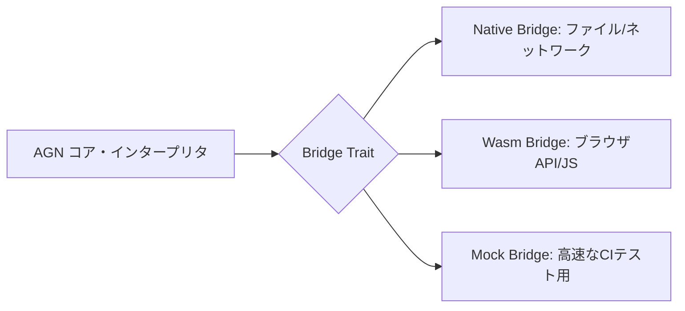

# AGN (Antigravity-Native) 🚀

<p align="center">
  
  <br>
  <b>「AIが知能となり、GPUが翼となる。重力（既存の制約）を無視する開発体験を。」</b><br>
  Rustとwgpuを基盤とした、世界初のAIネイティブ・マルチリンガル・プログラミング言語。
</p>

---

[🇺🇸 English (英語)](README.md)

## 🌟 AGNとは？

**AGN (Antigravity-Native)** は、自然言語（日本語・英語）の直感性と、低レイヤ（Rust/LLVM）の圧倒的パフォーマンスを融合させた次世代のプログラミング言語です。

**Google Antigravity** 環境での動作を前提に設計されており、AIエージェントが開発者の「意図」を理解し、高度に最適化されたポータブルなコードへと変換します。

---

## 💎 主な特徴

- **🌐 マルチリンガル・ネイティブ構文**: 
  - 日本語（SOV）と英語（SVO）を等価に扱い、同一の論理構造（Unified AST）に変換します。
  - *例:* 
    - `X を 並列で 表示する` (日本語)
    - `parallel show X` (英語)
- **⚡️ 環境を選ばないポータビリティ (Bridge Pattern)**:
  - 統一された **Bridge Architecture** により、同一のコアロジックを **Native (デスクトップ)** と **Wasm (ブラウザ)** の両方で1行も変更せずに動作させることが可能です。
- **🎨 GPU加速型ユニバーサルUI**:
  - `wgpu` バックエンドを採用。Dribbble/Rive級のリッチなUIやアニメーションを、あらゆるプラットフォームで60fpsで描画します。
- **🤖 第三級オブジェクトとしてのAI**:
  - AI推論や物語生成を、言語標準の「動詞」として組み込んでいます。
  - `結果 は 入力 を 要約する`

---

## 🧠 アーキテクチャ: Bridgeパターン

AGN 2.0 では、巨大なインタープリタ（God Object）を解体し、プラットフォーム依存の副作用を Bridge レイヤーへと分離しました。



---

## 🚀 クイックスタート

### 必要要件
- Rust (latest stable)
- LLVM 15+ (ネイティブコンパイル用)

### インストール・実行
```bash
git clone https://github.com/naki0227/AGN.git
cd AGN
cargo run -- examples/simple_demo.agn
```

---

## 🗺 ロードマップ

- [x] **Phase 1-12**: コアカーネル、LLVMバックエンド、wgpuレンダリング
- [x] **Phase 18**: **Bridge Architecture** (インタープリタの疎結合化)
- [x] **Phase 19**: P2Pセキュリティ (ビーコン署名の実装)
- [ ] **Phase 20**: 分散共有状態 (CRDT) の導入
- [ ] **Phase 21**: LLVMベースのAOT（事前コンパイル）最適化

---

## 🤝 コントリビューション

AGNは、人間と計算機の関わり方を再定義することを目指すオープンソースプロジェクトです。バグレポートや機能提案をお待ちしています。

**Developer**: naki0227  
**Portfolio**: [enludus.vercel.app](https://enludus.vercel.app)

## 📄 ライセンス

このプロジェクトは MIT License の下で公開されています。
