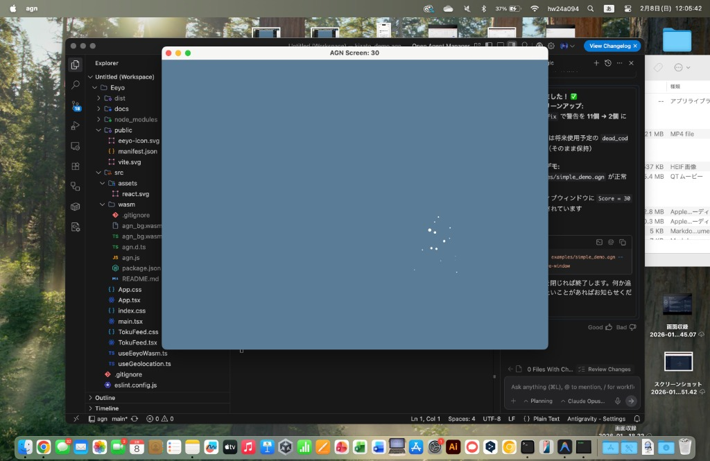
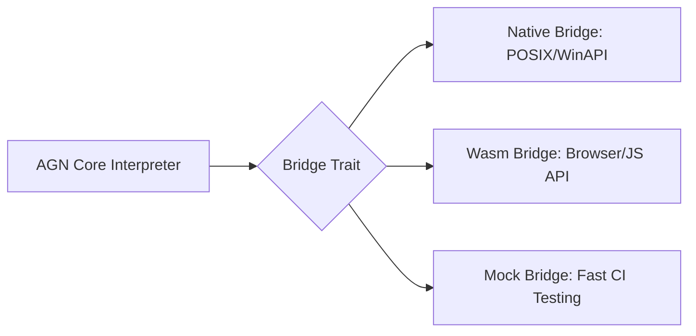

# AGN (Antigravity-Native) 🚀

<p align="center">
  
  <br>
  <b>"AI becomes the Intelligence, GPU becomes the Wings."</b><br>
  The world's first AI-native, multilingual programming language powered by Rust and wgpu.
</p>

---

[🇯🇵 Japanese (日本語)](README.ja.md)

## 🌟 What is AGN?

**AGN (Antigravity-Native)** is a next-generation programming language that fuses the intuitiveness of natural language (Japanese/English) with the overwhelming performance of low-level systems (Rust/WebGPU).

Engineered for the **Google Antigravity** era, it allows AI agents to understand intent and compile it into highly optimized, portable machine code.

---

## 💎 Key Features

- **🌐 Multilingual Native Syntax**: 
  - Treat Japanese (SOV) and English (SVO) equivalently. Both compile into a Unified AST.
  - *Example:* 
    - `X を 並列で 表示する` (JP)
    - `parallel show X` (EN)
- **⚡️ Environment Agnostic (Bridge Pattern)**:
  - Through a unified **Bridge Architecture**, AGN runs identical logic on **Native (Desktop)** and **Wasm (Browser)** environments.
- **🎨 GPU-Accelerated Universal UI**:
  - Leverages the `wgpu` backend to render 60fps high-fidelity animations and particles across all platforms.
- **🤖 AI as a First-class Citizen**:
  - AI inference and story generation are integrated as native language "verbs".
  - `imagine result from prompt`

---

## 🧠 Architecture: The Bridge Pattern

AGN 2.0 introduces a modular bridge layer that decoupling the core interpreter from platform-specific side effects.



---

## 🚀 Quick Start

### Prerequisites
- Rust (latest stable)
- LLVM 15+ (for native compilation)

### Installation
```bash
git clone https://github.com/naki0227/AGN.git
cd AGN
cargo run -- examples/simple_demo.agn
```

---

## 🗺 Roadmap

- [x] **Phase 1-12**: Core Kernel, LLVM Backend, and WGPU Rendering
- [x] **Phase 18**: **Bridge Architecture** (God Object decomposition)
- [x] **Phase 19**: P2P Security (Beacon Signatures)
- [ ] **Phase 20**: Distributed Shared State (CRDT)
- [ ] **Phase 21**: LLVM-based Ahead-of-Time (AOT) Optimization

---

## 🤝 Contribution

AGN is an open-source project aiming to redefine human-computer interaction. Contributions are welcome!

**Developer**: naki0227  
**Portfolio**: [enludus.vercel.app](https://enludus.vercel.app)

## 📄 License

This project is licensed under the MIT License.
